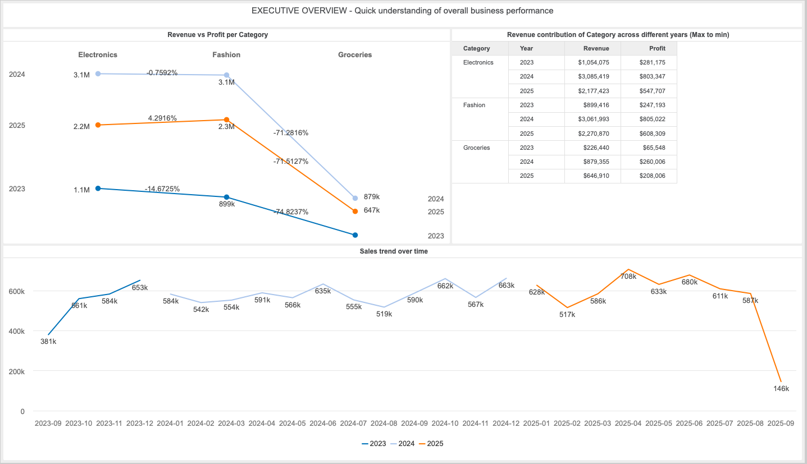
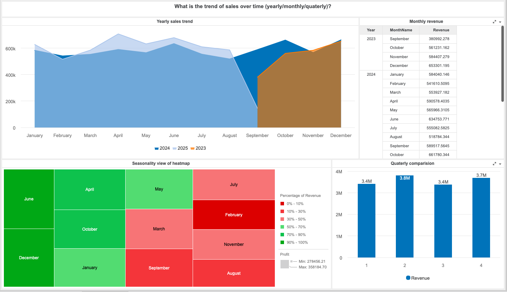
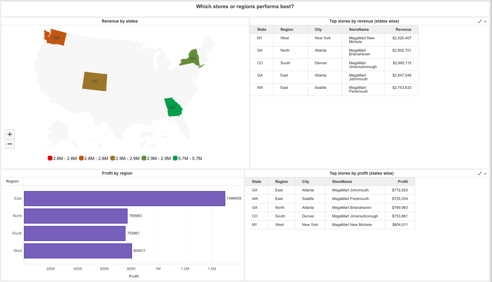
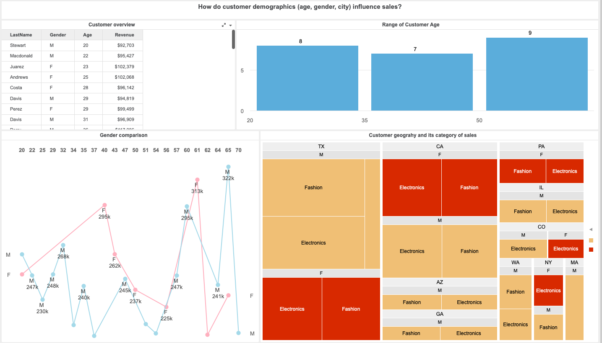
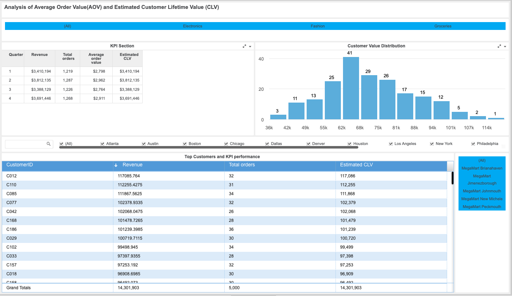

# Rohin Ram – Retail Sales & Customer Insights Dashboard

This project simulates a real-world retail analytics use case, focusing on sales performance, customer behavior and demographic impact.

The objective is to demonstrate the ability to:
1. Model business data using a star schema
2. Build actionable KPIs
3. Design interactive dashboards
4. Translate data into business insights

**A. Dataset Overview**

The dataset represents a multi-store retail business with over 5,000 transactions, including the following tables:

FactSales – transactional data (revenue, cost, profit, discount)
DimCustomer – customer demographics and age
DimProduct – product hierarchy (category, subcategory)
DimStore – store and regional information
DimDate – time attributes (year, month, quarter)

**B. Business Questions Addressed**

This project answers the following business questions:

1. Which products and categories drive the most sales and profit?
2. How do sales evolve (monthly, quarterly, yearly)?
3. Which stores and regions perform best?
4. How do customer demographics influence sales?
5. What is the Average Order Value (AOV) and Estimated Customer Lifetime Value (CLV)?

**C. Data Modeling & Preparation**

Data Preparation (Python)

Converted raw CSVs into analytical tables

Created derived fields:
Age
Revenue
Cost
Profit
Ensured consistent keys for analytics usage
BI Model

Fact table linked to dimensions using:
CustomerID
ProductID
StoreID
Date

**D. Dashboard Structure & Insights**

### 1. Sales & Category Performance

### 2. Sales Trends Over Time

### 3. Store & Region Performance

### 4. Customer Demographics Analysis

### 5. Average Order Value & Customer Lifetime Value

